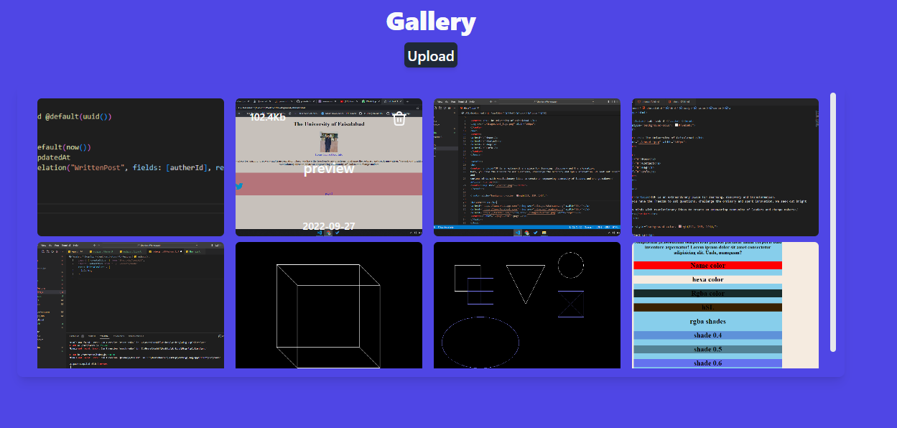

# Image-Gallery

An Amazing Image Gallery where you can upload images, delete and Update Images..

## Features

- Live previews
- Fullscreen mode
- Cross platform
- Completely Responsive
- Images will be saved in database
- Generate Cloudinary Image link

## Technologies

- Tailwindcss
- React.js
- Prisma
- PostgresQL
- Cloudinary
- Multer

## ScreenShots

## 🔗 Links

[](https://www.linkedin.com/in/kashif-ali-ba8241196/)
[](https://github.com/jaxkashif34)

## Installation & Starting Server

```bash
  clone Image-Gallery
  cd Image-Gallery
  npm install (install the server dependancies)
  cd client 
  npm install (install the client dependancies)
  npm start (in the root folder)
```
## Screenshots



## Authors

- [@jaxkashif34](https://github.com/jaxkashif34)
